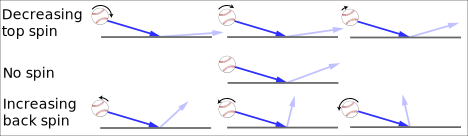

```{r setup, include=F, eval=F}
knitr::opts_chunk$set(echo = F, warning = F, message = F)

xaringanthemer::style_mono_accent(text_color = psu_navy)
```


# The last hop
.center[
<!-- <iframe width="560" height="315" -->
<iframe width="800" height="450"src="https://www.youtube.com/embed/S67zqwz05ys?start=70" title="YouTube video player" frameborder="0" allow="accelerometer; autoplay; clipboard-write; encrypted-media; gyroscope; picture-in-picture" allowfullscreen></iframe> -->
]
---
# Spin
class: center, middle




---
# The only math in this talk !


.middle.center.pull-left.bigger[
## Energy
$$\mathrm{E=mv^2}$$
]

.middle.center.pull-right.bigger[
## Friction

$$\mathrm{f=\mu \cdot N}$$
]


